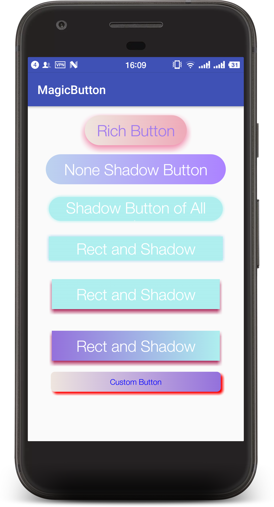

# GradientButton

A Button that supports gradient ramp for background, the Angle of the circular, shadow.
You can also customize it use hardcode.

# Preview

<div></img></div>

# Getting Started

In your `build.gradle:`

```java
dependencies {
	compile 'com.dagang:gradient-button:1.0.1'
}
```

# Usage


```java
<com.dagang.library.GradientButton
        android:layout_width="200dp"
        android:layout_height="80dp"
        app:button_end_color="#EEA9B8"
        app:button_gradient_orientation="LEFT_RIGHT"
        app:button_is_shadowed="true"
        app:button_press_end_color="#EEE5DE"
        app:button_press_start_color="#EEA9B8"
        app:button_radius="30dp"
        app:button_shadow_angle="90"
        app:button_shadow_color="#EE799F"
        app:button_shadow_distance="5dp"
        app:button_shadow_radius="10dp"
        app:button_size="10sp"
        app:button_start_color="#EEE5DE"
        app:button_text="Rich Button"
        app:button_text_color="#9F79EE" />
```
### or use java code
```java
GradientButton gradientButton = (GradientButton) findViewById(R.id.magic_button);
        TextView textView = gradientButton.getButton();
        textView.setText("Custom Button");
        textView.setTextColor(Color.BLUE);
        gradientButton.setButtonRadius(20);
        gradientButton.setShadowRadius(10);
        gradientButton.setShadowColor(Color.RED);
        gradientButton.setButtonStartColor(Color.parseColor("#EEE5DE"));
        gradientButton.setButtonEndColor(Color.parseColor("#9370DB"));
        gradientButton.setButtonPressStartColor(Color.BLACK);
        gradientButton.setButtonPressEndColor(Color.BLACK);
        gradientButton.setButtonGradientOrientation(GradientButton.LEFT_RIGHT);
        gradientButton.getButton().setOnClickListener(new View.OnClickListener() {
            @Override
            public void onClick(View v) {
                Toast.makeText(MainActivity.this, "onClick", Toast.LENGTH_LONG).show();
            }
        });
```

# Thanks

[ShadowLayout](https://github.com/Devlight/ShadowLayout)
# Contact me
Email: [dagangxx@gmail.com](dagangxx@gmail.com)
